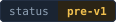
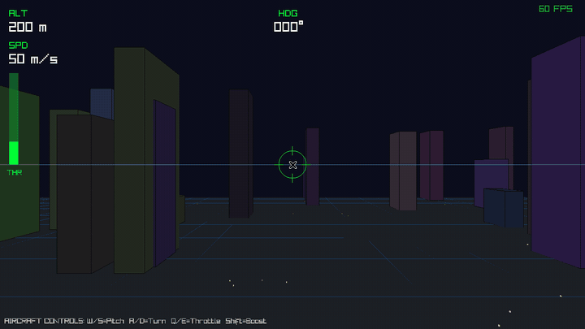

<p align="center">
  
</p>

<p align="center">
  <a href="LICENSE"></a>
  
  <a href="docs/MVP.md"></a>
  <a href="#try-it"></a>
</p>

# Z23

Imagine opening an application and saying *"make the plane turn faster,"* *"add
multiplayer,"* or *"change this screen."*

Z23 finds reusable C23, creates the missing behavior, builds it on your machine,
and shows you the result. You choose the version you want to keep. Other
machines can reproduce that exact source and preserve it, peer to peer.

**Z23 is infrastructure for software that can be changed for the person using
it.**

Further out it is an economy, not a tool. A person describes an outcome; their
node searches a global commons of permissively licensed C23, reuses what exists,
asks AI workers to create what is missing, hires peer compute when the work is
heavy, verifies the result locally, and hands back an exact application they
own. Other nodes reproduce, improve, preserve and serve it. ZCL pays for what
stays scarce — compute, verification, storage, hosting, bounties, delivery —
while reusable source stays free. The bar: **asking for useful software should
be easier than finding an app in a store, and what you get should outlive
whoever made it.**

---

## Try it

```bash
git clone https://github.com/z23c/z23
cd z23
make -j"$(nproc)"
make commons-demo
```

Two fresh nodes start on your machine with empty datadirs. Nothing outside your
machine is contacted, and exit 0 means every step below held — each one asserts
its own promise and stops at the first that does not.

- Ask for software behavior.
- Reuse C23 from another node.
- Build and accept an exact result.
- Another node fetches it and reproduces it peer to peer.

Reproduce means what it sounds like: the second node re-derives the identical
source from content addresses it verified itself, then builds a byte-identical
program. Altered source, an unknown dependency and a stale acceptance are each
refused by name rather than by silence, so the demo cannot print a happy summary
over a failure.


The same journey across two separate machines, with the publisher then taken
offline, is `make commons-multihost-acceptance`.

---

## The flow

**DESCRIBE → REUSE → CREATE → SEE → KEEP → SHARE**


- **DESCRIBE** — say what you want the software to do, in your own words.
- **REUSE** — Z23 looks for C23 in the commons that already does part of it.
- **CREATE** — only the missing behavior is written, built and tested.
- **SEE** — you experience the changed application before anything is published.
- **KEEP** — you accept one exact version, by hand, and it stays yours.
- **SHARE** — peers fetch that exact source, reproduce it, and preserve it.

SEE is what the rest is in service of. Packages, roots and publication are
machinery; the moment that matters is the application doing what you asked, on
your screen, before anyone has published anything.

---

## The flagship



The flagship is an application you are actually using. Fly it. Ask for a change.
See the new behavior. Keep that exact version. Share it peer to peer.

> *"Make the aircraft turn faster."*
> *"Add a blue engine trail."*
> *"Make these enemies cooperate."*
> *"Add a new building I can enter."*

---

## Principles that do not bend

- **C23 source first.** Small, fast, portable native software.
- **Permissive open source.** Public commons releases are author-signed and
  carry an allowlisted permissive license; your node refuses to announce or
  serve anything that does not verify. See
  [P2P source hosting](docs/P2P_SOURCE_HOSTING.md).
- **Local verification.** Your machine re-derives what it was told, from content
  addresses it checked itself. Nothing is accepted because a server said so.
- **No privileged coordinator.** Discovery is peer to peer; no central registry
  is required, and no node holds a position the others cannot.
- **Free reuse first, payment only where scarcity remains.** Copying source
  costs nothing and stays free. Compute, verification, storage and hosting are
  real costs, and those are what ZCL is for.

---

## The chain

The same binary is a ZClassic full node. The chain gives the commons durable
ordering, payments, names and anchors, while application source and builds stay
off-chain where they belong — a blockchain is a terrible place to put a source
tree and a good place to agree on what happened first. The development loop
above does not wait on it: you can run the whole flow before your node has
caught up to the tip.

---

## Run the node

```bash
build/bin/z23 status
build/bin/z23 core sync diagnose
build/bin/z23 ops logs
```

Every command is a leaf of the native command registry, so nothing here has to
be memorised — `build/bin/z23 discover help` prints the live surface, and
`build/bin/z23 discover describe <leaf>` prints one command's typed contract.


For development, `make dev-bin` builds the faster development binary and
`make t-fast ONLY=<group>` runs one of the registered parallel groups.

---

## Go deeper

| | |
| --- | --- |
| **Public start here** | [Getting started](docs/GETTING_STARTED.md) |
| The commons | [C23 Commons quickstart](docs/C23_COMMONS_QUICKSTART.md) |
| Verification | [Security and integrity](docs/SECURITY_AND_INTEGRITY.md) |
| Design | [Architecture north star](docs/ARCHITECTURE_NORTH_STAR.md) |
| The market | [ZCODE plan](docs/work/ZCODE_PLAN.md) |
| Contributing | [Developing](docs/DEVELOPING.md) |
| Where it stands | [MVP criteria](docs/MVP.md) |

Z23 is Apache-2.0. The name is the chain (ZClassic) and the language (C23),
because the two are the same project.
