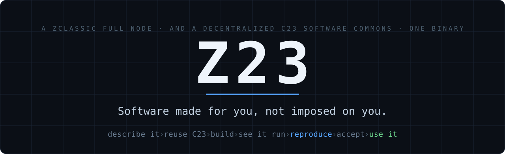
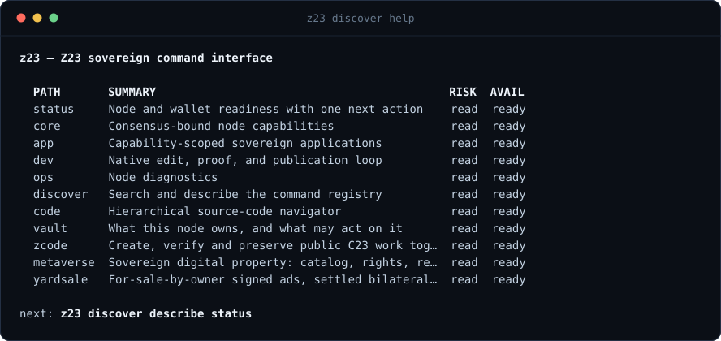
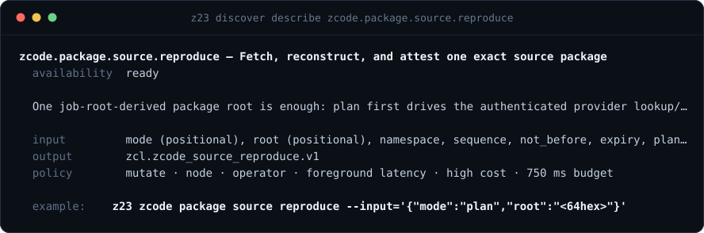
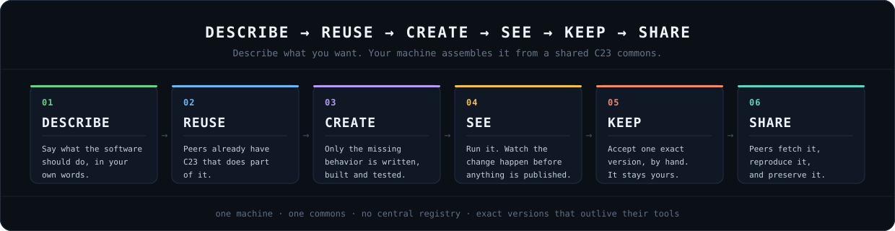
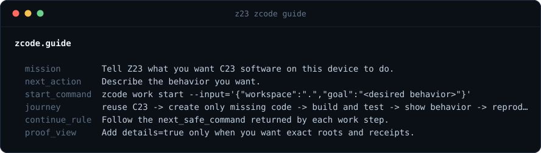

<p align="center">
  
</p>

<p align="center">
  <a href="LICENSE"></a>
  
  <a href="docs/MVP.md"></a>
  <a href="docs/DEFENSIVE_CODING.md"></a>
  <a href="docs/ARENA.md"></a>
</p>

You describe what you want a device to do. Existing C23 parts are reused
first, only the missing code is written, the result is built and run in front
of you, and a second machine re-derives the exact same bytes before you accept
it. After that it is yours — and it keeps working when the agent, the vendor,
the registry, or the company that produced it is gone.

Z23 is a public ZClassic (ZCL) full node in one self-contained C23 binary, and
that same node is a decentralized C23 software commons. No central registry,
no account, no API key, and nothing to install at runtime.

---

## Start by watching something prove itself

All you need is a C compiler. No chain sync, no Tor, no wallet, no browser, no
JavaScript, no Python, no network, no running node.

```bash
git clone https://github.com/z23c/z23.git && cd z23
make arena-demo
```

Two pilot programs fly a dogfight in confinement. Your machine then replays the
recorded match with no pilots at all, re-derives the roots, and refuses a copy
with a single byte changed:

```text
ZCODE ARENA
Red Ace defeated Blue Drone 10-6
11,941 deterministic ticks

Replay verification:       MATCH
Result vs pinned roots:    MATCH
Altered control byte:      REFUSED (match-incomplete)

Replay root:               05ed352dbb2213aad289cdf403d424d18d9ae075db57252a52c4e745a25e8396
Final-state root:          e4b37a9b94547cead91a7d4ae2a63b0385b29a99bb603bd0ac3519cebd270ebd
```


Those digests are the whole idea in miniature. Another machine that builds the
same sources prints the same digests — and names the mismatch when it cannot.
Write your own pilot, and read the two-node proof plus the honest gaps, in
[`docs/ARENA.md`](docs/ARENA.md).

---

## Then ask your node what it can do

You never have to memorize this repository. The binary carries a typed command
registry, and the catalog is discoverable from the binary itself: every leaf
declares its summary, risk class, latency and availability.



Two rules make that surface navigable without documentation. Every reply is
self-describing and size-bounded — the `…` above is a bounded reply, not a
broken one. And every reply, including every failure, names the next safe
command, so you are never left holding an error with no move.

Before calling anything, you can read its exact contract — inputs, output
schema, risk, cost and time budget:



This is the same surface an AI agent drives. No vendor SDK, no model lock-in,
and no separate agent API to keep in sync. Full contract:
[`docs/NATIVE_COMMAND_INTERFACE.md`](docs/NATIVE_COMMAND_INTERFACE.md).

---

## One journey: intent to working software



Ask the node for the journey rather than trusting this page:

```bash
build/bin/z23 zcode guide
```



| Step | One command |
| --- | --- |
| Describe the behavior you want | `z23 zcode guide` |
| Reuse existing C23 first, create only what is missing | `z23 zcode work start --datadir=/tmp/z23-work --input='{"workspace":".","goal":"<desired behavior>"}'` |
| Build and test it, contained | `z23 zcode work run --datadir=/tmp/z23-work --input='{"work":"latest","adapter":"manual"}'` |
| See the real consequence | `z23 zcode work show --input='{"work":"latest"}'` |
| Reproduce it on another node | `z23 zcode package source reproduce --datadir=/tmp/z23-commons` |
| Accept the exact version | `z23 zcode work accept --datadir=/tmp/z23-work --input='{"work":"latest"}'` |
| Use it in a real application | `z23 zcode use --datadir=/tmp/z23-commons` |

Every step returns the next safe command, so the journey never depends on
remembering that table. The scratch datadirs keep an experiment off your live
node; drop them once you mean to act on the real one.

Authority never escalates on its own: fetching does not authorize building,
building does not authorize installing, linking, executing or deploying, and
acceptance stays a human decision about one exact version, taken on your node
under your policy. The full walkthrough, with inputs and failure paths, is
[`docs/C23_COMMONS_QUICKSTART.md`](docs/C23_COMMONS_QUICKSTART.md).

---

## What you can do with your own node

Every command below runs against your machine. You are not asking a service.

| You can | Start here |
| --- | --- |
| **Hold and spend ZCL from a node you validated yourself** — transparent and shielded Sapling addresses in the same binary | `build/bin/zclassic-cli z_getnewaddress` |
| **Serve a site with no domain name and no certificate** — in-process Tor onion: no SOCKS proxy, no second daemon, no port forwarding | `build/bin/z23 -tor` |
| **Buy and sell without exposing an IP** — yardsale gossips signed, expiring ads byte-identically; buyer and seller settle bilaterally over the onion | `build/bin/z23 discover help yardsale` |
| **Register an on-chain name** — ZNAM, 1–63 characters, carrying ZCL/BTC/LTC/DOGE addresses plus free-form text records | `build/bin/zclassic-cli name_register "yourname"` |
| **Browse your own chain** — block explorer at `/explorer`, JSON API from `/api/v1` (the RPC port answers a plain `GET` with `405`, by design) | `build/bin/z23 status` |
| **Send shielded messages** — on-chain messages ride inside the 512-byte encrypted Sapling memo | `build/bin/zclassic-cli msg_send <addr> "text"` |
| **Mine** — Equihash 200,9 in the same binary, validating what it mines against the same rules as everyone else | `build/bin/z23 -gen` |
| **Measure peers and play P2P games** — peer latency in microseconds, with a working TicTacToe as the reference implementation | `build/bin/z23 core network peers latency` |
| **Publish and reproduce exact C23 packages** — the commons, plus optional application layers such as signed spaces | `build/bin/z23 zcode guide` |
| **Let an AI agent operate the node** — typed commands with schemas, byte budgets and risk classes | `build/bin/z23 discover help` |

Receiving, sending, verifying and relaying shielded funds all use the in-tree
native C23 Sapling implementation. No Rust toolchain, library or runtime is
part of Z23.

Three things worth knowing before you go looking for them. The default build
links a Tor *stub*, so `-tor` runs the node normally without an onion and says
so in the log; the real onion is opt-in because Tor is a large dependency, not
because it is unfinished (`git submodule update --init vendor/tor`, then
[`docs/BUILD.md`](docs/BUILD.md)). For clearnet, drop a certificate at
`<datadir>/ssl/fullchain.pem` and `privkey.pem` and the HTTPS explorer starts
on port `8443` once the node is near tip. With no certificate and no Tor there
is deliberately **no** public endpoint — the node is private by default.

Any node can host its own MVC-style web app on its onion exactly the way the
explorer and yardsale do; the recipe is
[`docs/cookbook/13_host_your_own_mvc_onion_app.md`](docs/cookbook/13_host_your_own_mvc_onion_app.md).

**Working on this repository with an agent?** Start at [`AGENTS.md`](AGENTS.md)
— mission, safety boundary, the first commands in a fresh clone, and the gates
the agent must respect. The daily-driver manuals are
[`docs/DEVELOPING.md`](docs/DEVELOPING.md) and
[`docs/CODEBASE_MAP.md`](docs/CODEBASE_MAP.md).

---

## How you check, instead of taking this page's word

**Verify, don't trust.** Any agent may propose code and any node may perform
computation, but each receiving node verifies exact objects, signatures, roots
and evidence under its own local policy. Nothing is accepted because of who
produced it, and no central service or project developer is an authority a
node must rely on.

- Content roots identify exact bytes.
- Signatures identify the key that made a statement.
- Build, test and reproduction receipts record exact observations under bound
  inputs; independent reproduction checks an exact build claim.
- Evidence proves only its declared claim. It does not by itself establish
  that arbitrary code is safe, correct, secure, useful, or worth accepting.

Each property below names the mechanism *and* the command that shows it.

| Property | Check it yourself |
| --- | --- |
| **A validity decision has exactly two inputs** — the binary you compiled, and the proof-of-work-heaviest header chain. No operator attestation, no certificate authority, no registry lookup anywhere in a consensus path. | [`docs/HOW_THE_NODE_WORKS.md`](docs/HOW_THE_NODE_WORKS.md) |
| **`core/` is byte-sealed** — checkpoints, chain params and consensus math are pinned by `core/MANIFEST.sha3`. Any byte change fails `check-core-seal` and needs a recorded unseal ([`core/UNSEAL.md`](core/UNSEAL.md)). This binds an AI agent working on the code exactly as much as it binds you. | `make lint` |
| **Consensus stays bit-compatible with `zclassicd`** — enforced by `check-consensus-parity` plus a golden-value test group; consensus-changing contributions are declined ([`docs/CONSENSUS_PARITY_DOCTRINE.md`](docs/CONSENSUS_PARITY_DOCTRINE.md)). | `make -j"$(nproc)" t-fast ONLY=consensus_parity` |
| **The process restricts itself before it reports ready** — `-sandbox=steady` applies `no_new_privs`, `PR_SET_DUMPABLE(0)`, Landlock datadir grants and a seccomp deny-list, installed with seccomp `TSYNC` so already-running P2P and validation threads are covered, not only new ones. | `build/bin/z23 dumpstate sandbox` |
| **No subprocess execution** — zero `system()` and `popen()` in shipped app/lib/config code, enforced by a gate rather than by convention. An explicitly admitted commons build or test action may invoke its bound toolchain only inside the separate bounded worker lifecycle; fetching source never invokes it. | `make lint` |
| **Wallet secrets have exactly one writer** — the encryption-aware `wallet_sqlite` layer. The old plaintext mirror is deleted and a gate ratchets that it never returns. Keys wrap in AES-256-GCM (PBKDF2-HMAC-SHA512, 200k iterations) under a passphrase; with no passphrase they are raw 32-byte blobs and the datadir is the protection ([`docs/CUSTODY_MODEL.md`](docs/CUSTODY_MODEL.md)). | `make lint` |
| **Crash recovery is executed, not claimed** — a node is kill-9ed mid-write on an isolated datadir and must fold back to its tip with no manual repair. | `make test-crash-bootstrap` |
| **Read-only queries are constrained by construction** — SELECT-only, semicolons rejected, auto-`LIMIT`, a wall-clock budget, and wallet-secret tables denied by name. | `build/bin/z23 core storage query` |
| **The gates run on your machine**, with no hosted CI service in the loop. | `make lint && make ci` |

And the boundaries, stated plainly. Z23 has no central coordinator and no
central package registry. It never executes downloaded C merely because it was
fetched or stored. It does not claim that tests, signatures or reproduction
prove general safety. The C23 Commons does not change ZClassic consensus. It
does not require one AI vendor — AI workers are replaceable proposal engines.
And it has no live ZC23 token economics today; those surfaces remain
simulation-only.

Full boundary:
[`docs/SECURITY_AND_INTEGRITY.md`](docs/SECURITY_AND_INTEGRITY.md). The gates
that specifically stop an AI agent from claiming a result it cannot cite:
[`docs/AI_SAFETY_GATES.md`](docs/AI_SAFETY_GATES.md).

---

## Build it

`make doctor` probes your machine and prints the exact install line for
anything missing. You need **gcc 14+** (or clang with working `-std=c23`), GNU
make, git, and a C++ compiler for the LevelDB test oracle.

```bash
make -j"$(nproc)"          # node + CLI + RPC tool -> build/bin/
make -j"$(nproc)" dev-bin  # fast non-LTO build for iterating -> build/bin/z23-dev
make -j"$(nproc)" test     # all registered parallel groups
make lint                  # the defensive-coding gates
```

The first `make` runs `make vendor` once: it downloads pinned third-party
sources, checks each against a pinned SHA-256, and compiles them locally.
Every build after that is offline. Clone to passing test suite is about ten
minutes and 1.6 GB of disk — `make first-build-timing` measures it on your own
hardware. The shipped binary links only stock `libc` plus static archives in
`vendor/lib/`, so there is nothing to install at runtime and nothing to keep
updated.

Day to day you want `make dev-bin`: it skips LTO, rebuilds only what changed,
and the compile cache that ships in this repository serves the rest.

Datadir is `~/.zclassic-c23/` (`-datadir=DIR`). Default ports: P2P `8033`, RPC
`18232`. The fresh-machine walkthrough — build, run a node and explorer, set up
an isolated development instance — is
[`docs/GETTING_STARTED.md`](docs/GETTING_STARTED.md).

### When something looks wrong

The node reports its own state, so start with its typed diagnostics rather
than with a log file:

```bash
build/bin/z23 status                    # height, peers, sync, blocker, health
build/bin/z23 core sync diagnose        # why sync is where it is
build/bin/z23 ops logs --pattern='error|warn'
build/bin/z23 ops health                # synced / has_peers / tip_stale / tip_lag
```

A stall is never a silent stop: if the height is frozen, `status` names the
cause in `primary_blocker`. If peers stay at `0`, add onion seeds to
`~/.config/zclassic23/onion-seeds` so the node can find peers without DNS.
Deeper paths, including kill-9 and out-of-memory recovery, are in
[`docs/RUNBOOK.md`](docs/RUNBOOK.md).

### Reaching the chain tip

A fresh node is honestly empty — `getblockcount` returns `0` until blocks are
actually folded, never a phantom tip — and then syncs from peers. There are no
DNS seeders; the node bootstraps from verified IP seeds baked into the sealed
consensus core plus a Tor onion directory, harvesting peers from each onion's
`/directory.json`. Add your own in `~/.config/zclassic23/onion-seeds`.

A plain start from an empty datadir takes hours. If you already run the C++
`zclassicd`, importing its headers first is the fast path — and the order
matters, because skipping the import leaves a ~3.1M-header hole and the node
pins:

```bash
build/bin/z23 --importblockindex ~/.zclassic   # headers FIRST
build/bin/z23                                  # then a normal boot
```

Every path, including the prebuilt starter pack and its honest limits, is in
[`docs/BOOTSTRAPPING.md`](docs/BOOTSTRAPPING.md) and
[`docs/SYNC.md`](docs/SYNC.md).

---

## Where it is today

**Pre-v1. Don't make it your only mainnet node yet.** The bar for v1 is the
eight acceptance criteria in [`docs/MVP.md`](docs/MVP.md).

Working now: full node and validation, wallet, mining, explorer and REST API,
onion service, the yardsale P2P marketplace (signed ad gossip plus bilateral
settlement), the ZCODE package commons and metaverse surfaces
(simulation-complete, no live ZC23), ZNAM names, on-chain shielded messaging,
the native command registry, P2P games.

Not finished yet, plainly:

- **Off-chain messages are plaintext on the wire.** The encrypted transport is
  written but not switched on by default. On-chain messages are shielded;
  off-chain ones should be treated as postcards.
- Cross-chain atomic swaps have contract and settlement plumbing but are not
  an end-to-end trade.
- The older chunk-serving file market (distinct from yardsale) gates chunks,
  but payment settlement is not wired through.
- ZC23 issuance and custody are pre-genesis and simulation-only, and every
  live-money path fails closed by design
  ([`docs/METAVERSE.md`](docs/METAVERSE.md)).
- The ~1-minute cold sync the fast-sync stack is designed for is a target, not
  today's proven path.

Ask the running node rather than treating this page as live state:
`z23 status`.

---

## Going further

- [`docs/GETTING_STARTED.md`](docs/GETTING_STARTED.md) — **Public start here**: first run on a fresh machine
- [`docs/C23_COMMONS_QUICKSTART.md`](docs/C23_COMMONS_QUICKSTART.md) — the journey, end to end
- [`docs/NATIVE_COMMAND_INTERFACE.md`](docs/NATIVE_COMMAND_INTERFACE.md) — the agent interface
- [`docs/HOW_THE_NODE_WORKS.md`](docs/HOW_THE_NODE_WORKS.md) — the node as a state machine
- [`docs/FRAMEWORK.md`](docs/FRAMEWORK.md) — architecture: the laws and the eight code shapes
- [`docs/CODEBASE_MAP.md`](docs/CODEBASE_MAP.md) — where everything lives
- [`docs/DEVELOPING.md`](docs/DEVELOPING.md) — the developer operating manual
- [`docs/BUILD.md`](docs/BUILD.md) — vendored sources, versions, build steps
- [`docs/RUNBOOK.md`](docs/RUNBOOK.md) — operating and troubleshooting
- [`docs/MVP.md`](docs/MVP.md) — v1 criteria and honest readiness
- [`AGENTS.md`](AGENTS.md) — model-neutral coding-agent entry point

**Something wrong?** `z23 status` first, then
[`docs/RUNBOOK.md`](docs/RUNBOOK.md). File bugs through GitHub Issues — the
templates in [`.github/ISSUE_TEMPLATE/`](.github/ISSUE_TEMPLATE/) ask for the
two things that make a report actionable. Security reports:
[`.github/SECURITY.md`](.github/SECURITY.md). Contributing:
[`.github/CONTRIBUTING.md`](.github/CONTRIBUTING.md).

## The name

**ZClassic23 is now Z23.** Same node, same protocol, same git history. The
repository moved to <https://github.com/z23c/z23>, and the old
`ZclassiC23/zclassic` URL redirects here. The binaries are `z23` / `z23-dev`,
with the old `zclassic23` names kept as aliases while scripts migrate.
Consensus, chain IDs, network parameters, `zcl.*` protocol domains, package
roots and the `~/.zclassic-c23` datadir are unchanged.

## License

Copyright 2026 Rhett Creighton. Apache License 2.0 — see [`LICENSE`](LICENSE).
Upstream notices (Bitcoin Core, Zcash, zclassicd, Tor, SQLite, secp256k1,
LevelDB, dcrdex) are in [`NOTICE`](NOTICE); concept attributions in
[`docs/ATTRIBUTIONS.md`](docs/ATTRIBUTIONS.md).
