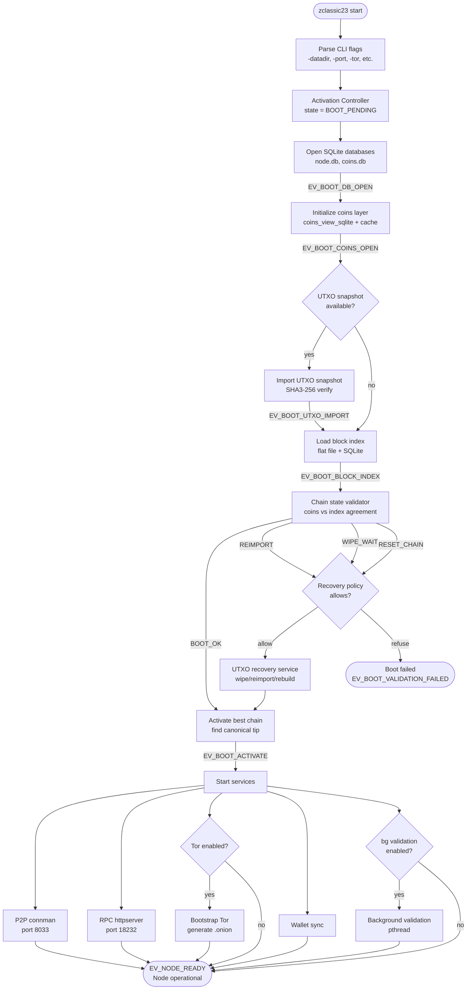
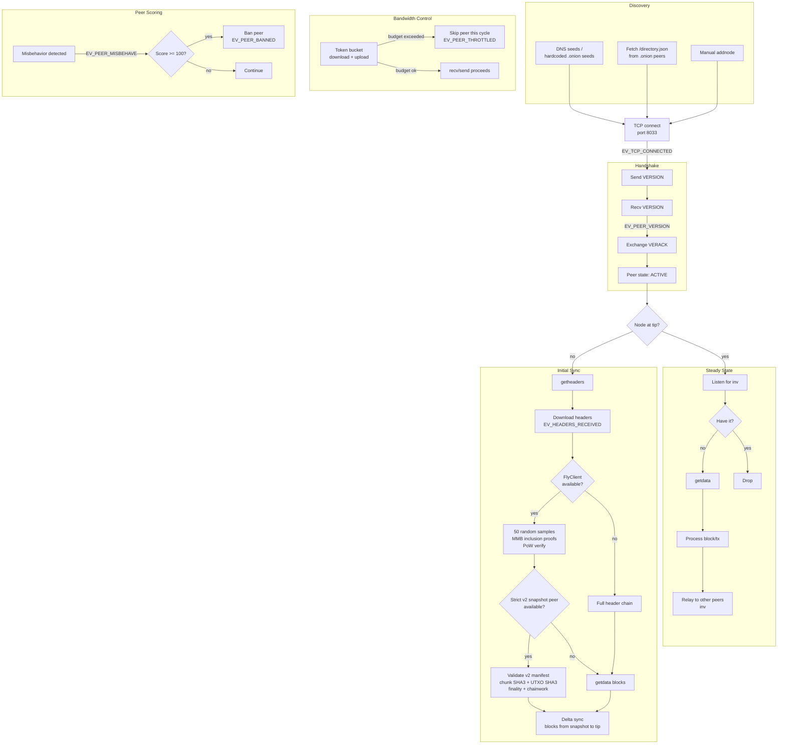
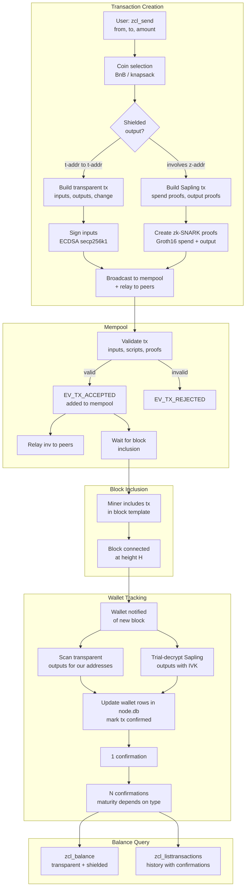
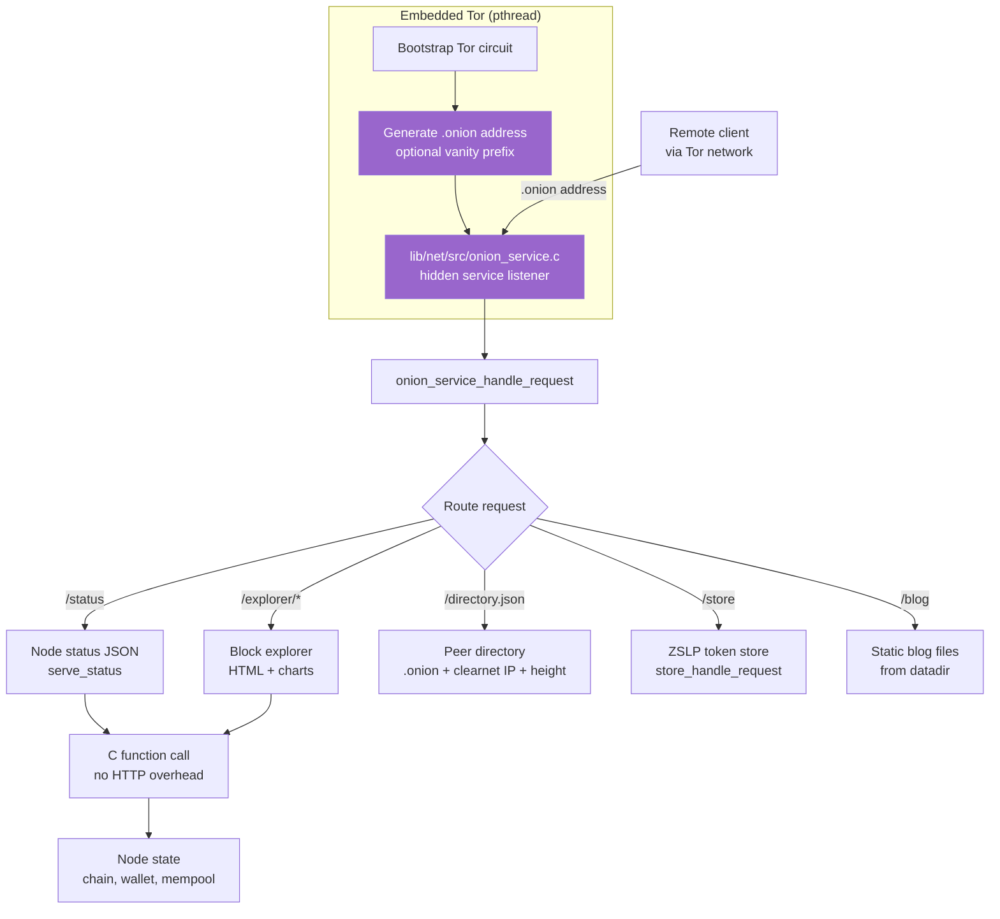

# ZClassic23 Architecture Diagrams

> **Note:** For the canonical architecture (the Prime Directive, the Ten Laws of Beauty, the eight shapes, and current-vs-target status) see [`FRAMEWORK.md`](./FRAMEWORK.md). The diagrams below remain useful references for the **current** boot sequence and subsystem topology. See also [`adr/0001-personal-sovereignty-stack.md`](./adr/0001-personal-sovereignty-stack.md) for the pivot rationale.

Mermaid diagrams for the core subsystems. Render with any Mermaid-compatible viewer (GitHub, Obsidian, mermaid.live).

---

## Boot Sequence



---

## P2P Network Flow



---

## Block Validation Pipeline

```mermaid
flowchart TD
    RECEIVE[Block received<br/>from P2P or RPC] --> INGEST[reducer_ingest_block]

    INGEST --> CHECK_BLOCK[check_block<br/>structure validation]

    subgraph Structural["Structure Checks"]
        CHECK_BLOCK --> HEADER_CHECK[Header validation<br/>PoW, timestamp, difficulty]
        HEADER_CHECK --> MERKLE[Merkle root<br/>verify]
        MERKLE --> TX_BASIC[Transaction structure<br/>version, size, format]
    end

    TX_BASIC -->|EV_BLOCK_CHECK_PASSED| HEADER_ADMIT[header_admit stage<br/>candidate fact]

    HEADER_ADMIT --> VALIDATE_HEADERS[validate_headers stage<br/>contextual header checks]
    VALIDATE_HEADERS --> BODY_FETCH[body_fetch stage<br/>request missing bodies]
    BODY_FETCH --> BODY_PERSIST[body_persist stage<br/>store block bytes]
    BODY_PERSIST --> SCRIPT_VALIDATE[script_validate stage<br/>transparent scripts]
    SCRIPT_VALIDATE --> PROOF_VALIDATE[proof_validate stage<br/>shielded proofs]
    PROOF_VALIDATE --> UTXO_APPLY[utxo_apply stage<br/>same-txn UTXO delta]
    UTXO_APPLY --> TIP_FINALIZE[tip_finalize stage<br/>publish reducer tip]

    TIP_FINALIZE --> BEST_CHECK{New block extends<br/>best chain?}
    BEST_CHECK -->|no, but more work| REORG
    BEST_CHECK -->|no| DONE_SIDE([Stored as<br/>side chain])
    BEST_CHECK -->|yes| CONNECT

    subgraph Reorg["Reorganization"]
        REORG[EV_REORG_START] --> UNWIND[Reducer unwind<br/>inverse UTXO deltas]
        UNWIND -->|fail| REORG_FAIL([typed blocker<br/>manual intervention])
        UNWIND -->|ok| RECONNECT[Apply winning branch<br/>from fork point]
    end

    RECONNECT --> CONNECT

    subgraph Connection["connect_block"]
        CONNECT[EV_BLOCK_CONNECT_START] --> INPUTS[Check inputs exist<br/>in UTXO set]
        INPUTS -->|EV_TX_INPUTS_CHECKED| SCRIPTS[Verify scripts<br/>ECDSA secp256k1]
        SCRIPTS -->|EV_SCRIPT_VERIFIED| SAPLING{Sapling<br/>txs?}
        SAPLING -->|yes| GROTH16[Verify Groth16<br/>spend + output proofs]
        SAPLING -->|no| TURNSTILE
        GROTH16 --> TURNSTILE[Turnstile check<br/>sprout + sapling pools]
        TURNSTILE -->|EV_TURNSTILE_CHECK| UTXO_UPDATE[Update UTXO set<br/>spend inputs, create outputs]
        UTXO_UPDATE --> CHECKPOINT{UTXO checkpoint<br/>height?}
        CHECKPOINT -->|yes| VERIFY_CP[Verify UTXO commitment<br/>against hardcoded hash]
        CHECKPOINT -->|no| FLUSH_CHECK
        VERIFY_CP -->|pass| FLUSH_CHECK
        VERIFY_CP -->|fail| REJECT([EV_UTXO_CHECKPOINT_FAIL<br/>block rejected])
    end

    FLUSH_CHECK{Flush needed?} -->|yes| FLUSH[Flush coins to SQLite<br/>EV_COINS_FLUSH]
    FLUSH_CHECK -->|no| TIP_UPDATE
    FLUSH --> TIP_UPDATE

    TIP_UPDATE[Publish reducer tip<br/>EV_TIP_UPDATED] --> NOTIFY[Notify wallet,<br/>mempool, subscribers]
    NOTIFY -->|EV_BLOCK_CONNECT_DONE| DONE([Block connected])

    CHECK_BLOCK -->|fail| REJECT_BLOCK([EV_BLOCK_REJECTED<br/>dos score assigned])
```



---

## Wallet Transaction Lifecycle



---

## MCP Request Routing

```mermaid
flowchart TD
    CLIENT[Claude Code<br/>or MCP client] -->|stdio JSON-RPC| MCP_READ[Read request<br/>from stdin]

    MCP_READ --> PARSE[Parse JSON-RPC envelope<br/>method, params, id]
    PARSE -->|tools/call| MIDDLEWARE

    subgraph Middleware["MCP Middleware"]
        MIDDLEWARE[mcp_middleware_dispatch] --> AUTH{Bearer token<br/>required?}
        AUTH -->|yes, missing| AUTH_DENY([MCP_ERR_AUTH_REQUIRED])
        AUTH -->|ok or disabled| RATE_GLOBAL{Global rate<br/>limit ok?}
        RATE_GLOBAL -->|no| RATE_DENY([MCP_ERR_RATE_LIMITED])
        RATE_GLOBAL -->|yes| DESTRUCTIVE{Destructive<br/>tool?}
        DESTRUCTIVE -->|yes| RATE_DESTR{Destructive<br/>rate ok?}
        DESTRUCTIVE -->|no| ROUTE
        RATE_DESTR -->|no| RATE_DENY
        RATE_DESTR -->|yes| ROUTE
    end

    subgraph Router["MCP Router"]
        ROUTE[mcp_router_dispatch] --> FIND{Tool exists?}
        FIND -->|no| UNKNOWN([MCP_ERR_UNKNOWN_TOOL])
        FIND -->|yes| VALIDATE[Validate params<br/>type, range, enum, required]
        VALIDATE -->|fail| PARAM_ERR([MCP_ERR_MISSING_PARAM<br/>or INVALID_TYPE<br/>or OUT_OF_RANGE])
        VALIDATE -->|ok| HANDLER[Call tool handler<br/>with timeout]
        HANDLER -->|timeout| TIMEOUT([MCP_ERR_TOOL_TIMEOUT])
        HANDLER -->|error| HANDLER_ERR([MCP_ERR_HANDLER_FAILED])
        HANDLER -->|ok| RESULT[Build result JSON]
    end

    subgraph Handlers["Tool Handler Layer"]
        direction LR
        H_OPS[ops_controller<br/>status, health, kpi]
        H_CHAIN[chain RPCs<br/>getblock, syncstate]
        H_NET[net RPCs<br/>peers, addnode]
        H_WALLET[wallet RPCs<br/>balance, send]
        H_APP[app RPCs<br/>names, messages, market]
    end

    HANDLER --> H_OPS
    HANDLER --> H_CHAIN
    HANDLER --> H_NET
    HANDLER --> H_WALLET
    HANDLER --> H_APP

    H_OPS --> RPC_LAYER
    H_CHAIN --> RPC_LAYER
    H_NET --> RPC_LAYER
    H_WALLET --> RPC_LAYER
    H_APP --> RPC_LAYER

    subgraph RPC["RPC Layer"]
        RPC_LAYER[rpc_table_execute] --> NODE[Node internals<br/>chain, mempool, wallet, connman]
    end

    RESULT -->|EV_MCP_REQUEST| METRICS[Record metrics<br/>tool, code, latency]
    METRICS --> RESPOND[Write JSON-RPC response<br/>to stdout]
    RESPOND --> CLIENT

    subgraph Observability
        METRICS --> PROM[/metrics endpoint<br/>Prometheus format]
        METRICS --> WS[WebSocket /events<br/>real-time stream]
    end
```

---

## Onion Service Architecture


